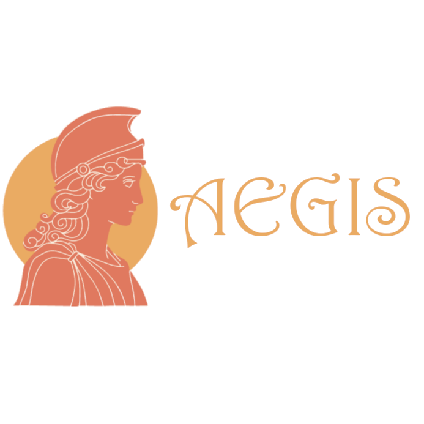

# Aegis - The Silver Thread

> A solution to eliminate all forms of violence against women and girls.

Aegis is a mobile application developed using React Native and Django Rest Framework, aimed to provide a safe space with centralized services for quick action in case of danger. The app is designed to empower women, girls and vulnerable communities by offering a tool for personal safety, quick communication, and access to resources and information.

## The name and the logo

Aegis in ancient Greek mythology, was the shield of Athena, symbolizing protection and strength. In this spirit, the app is named to represent a shield for protection extended from one woman to another. Alongside with this idea, The Silver Thread draws from Norse mythology, where the Norns—goddesses of fate—are said to weave the destinies of the bravest warriors with a silver thread. With this app, I aspire to change the destinies of modern warriors by empowering them with the tools they need for safety and resilience.

The logo design incorporates an element sourced from [Freepik](https://www.freepik.com/free-vector/flat-design-athena-logo-template_37561346.htm#fromView=search&page=1&position=8&uuid=78592bf7-cce8-443a-847d-b37cb2736f7c), , with additional alterations and design refinements, resulting in a final image that is my own work. 
> The design was made with [Gimp](https://www.gimp.org/)

## Installation
Python:
pip install -r requirements.txt
python manage.py runserver 0.0.0.0:8000

React
npm install
